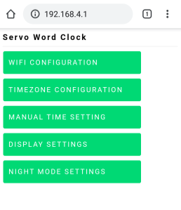

# Servo Word Clock Code - Version 1
> Code for Servo Word Clock for ESP32 and ESP8266

Allows control of clock via webserver that runs on ESP. Programmed using Arduino IDE.

## Code Upload

- Install Arduino IDE

- Install ESP library

- Upload to ESP using Arduino IDE

## Code Manual

see Manual.pdf 

