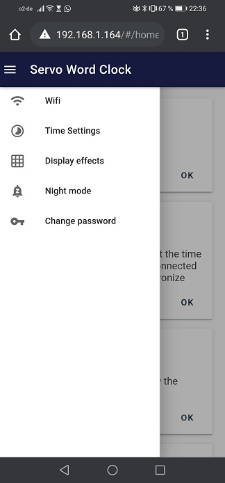

# Servo Word Clock GUI - Version 2
> Code for Servo Word Clock for ESP8266

Allows control of clock via webserver that runs on ESP. GUI based on preact material UI. 



## Build

- Install [node js](https://nodejs.org/en/)

- open terminal in folder "servowordclock-gui-develop"

```sh
npm i

npm run build
```

## Code Upload

- Install Arduino IDE

- Install ESP8266 addon

- Install ESP8266LittleFS tool

- Install required libraries
	- https://github.com/me-no-dev/ESPAsyncTCP
	- https://github.com/me-no-dev/ESPAsyncWebServer
	- https://github.com/adafruit/Adafruit-PWM-Servo-Driver-Library
	- https://github.com/FastLED/FastLED

- in Arduino IDE select Tools -> Boards -> ESP8266 Boards -> Node MCU 1.0 (ESP-12E)

- Upload LittleFS Data using Arduino IDE

- Upload code to ESP using Arduino IDE

- Once code has been uploaded following updates can be done via Wifi (OTA) with password "ServoWordClockOTA"

## Code Manual

see Manual.pdf 

